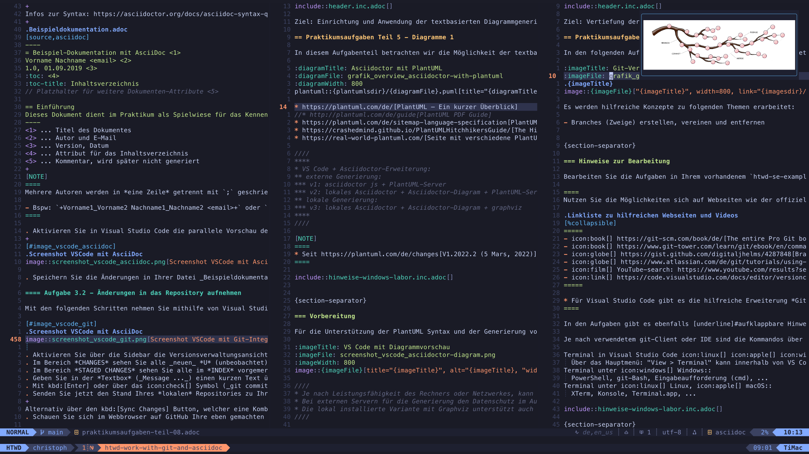

# tree-sitter-asciidoc

AsciiDoc grammar for [tree-sitter](https://github.com/tree-sitter/tree-sitter)

Better other parsers:

- <https://github.com/cathaysia/tree-sitter-asciidoc>
- <https://github.com/cpkio/tree-sitter-asciidoc>

---

> [!WARNING]
> The grammar is not yet complete and the names of the rules or the structure of the tree nodes may change.

> [!NOTE]
> Until the first version of the AsciiDoc Language Specification is ratified, AsciiDoc is defined by the Asciidoctor implementation. There is no other official definition of the language.
>
> Source: [AsciiDoc Language Documentation - About this documentation](https://docs.asciidoctor.org/asciidoc/latest/#about-this-documentation)

## Screenshots



> [!NOTE]
> The highlights are work in progress. The colors are not yet final.
>
> With `set syntax=asciidoc` the default vim syntax colors can also be used.

## References

- [AsciiDoc Language Documentation](https://docs.asciidoctor.org/asciidoc/latest/)

## Rule Coverage

- Overview and progress of current: [Rule Coverage](./docs/rule_coverage.md)

## Use

### Neovim

Add the following to your `init.lua` or `nvim-treesitter.lua` config and after a restart run `:TSInstallFromGrammar asciidoc`.

```lua
-- Adds a (experimental) parser for AsciiDoc.
-- Source: https://github.com/nvim-treesitter/nvim-treesitter?tab=readme-ov-file#adding-parsers
-- `:TSInstallFromGrammar asciidoc`
local parser_config = require('nvim-treesitter.parsers').get_parser_configs()
parser_config.asciidoc = {
  install_info = {
    url = 'https://github.com/tigion/tree-sitter-asciidoc',
    files = { 'src/parser.c' },
    branch = 'main',
  },
}
```

For highlighting, copy the _queries/highlights.scm_ to your _nvim/queries/asciidoc/_ directory.

To support image preview with [Snacks.image](https://github.com/folke/snacks.nvim/blob/main/docs/image.md), add a file _nvim/queries/asciidoc/images.scm_ with the following content:

```scheme
; Show image from `image` macro.
(macro
  (name) @name (#eq? @name "image")
  (target) @image.src
) @image

; Optional: Show image from `imageFile` attribute.
(document_attribute
  (attribute_name) @name (#eq? @name "imageFile")
  (attribute_value) @image.src
) @image
```
