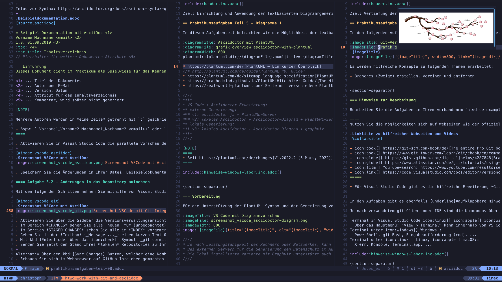

# tree-sitter-asciidoc

AsciiDoc grammar for [tree-sitter](https://github.com/tree-sitter/tree-sitter)

Better other parsers:

- <https://github.com/cathaysia/tree-sitter-asciidoc>
- <https://github.com/cpkio/tree-sitter-asciidoc>

---

> [!WARNING]
> The grammar is not yet complete and the names of the rules or the structure
> of the tree nodes may change.

> [!NOTE]
> Until the first version of the AsciiDoc Language Specification is ratified,
> AsciiDoc is defined by the Asciidoctor implementation. There is no other
> official definition of the language.
>
> Source: [AsciiDoc Language Documentation - About this documentation](https://docs.asciidoctor.org/asciidoc/latest/#about-this-documentation)

## Screenshots



> [!NOTE]
> The highlights are work in progress. The colors are not yet final.
>
> With `set syntax=asciidoc` the default vim syntax colors can also be used.

## References

- [AsciiDoc Language Documentation](https://docs.asciidoctor.org/asciidoc/latest/)

## Rule Coverage

- Overview and progress of current: [Rule Coverage](./docs/rule_coverage.md)

## Use

### Neovim

#### nvim-treesitter/nvim-treesitter

Add the following to your `init.lua` or `nvim-treesitter.lua` config and after
a restart run `:TSInstall asciidoc` (`:TSInstallFromGrammar asciidoc`).

##### main-Branch

```lua
-- asciidoc: Adds a (experimental) parser for AsciiDoc.
-- Source: https://github.com/nvim-treesitter/nvim-treesitter/blob/main/README.md#adding-parsers
--
-- NOTE: Install with:   `:TSInstall asciidoc`
--       Update with:    `:TSUpdate`
--       Uninstall with: `:TSUninstall asciidoc`
--
-- WARN: Uninstall with `:TSUninstall asciidoc`
-- This removes only in `~/.local/share/nvim/site/parser` and `queries` but
-- not in `parser-info`
--
vim.api.nvim_create_autocmd('User', {
pattern = 'TSUpdate',
  callback = function()
    ---@diagnostic disable-next-line missing-fields
    require('nvim-treesitter.parsers').asciidoc = {
      ---@diagnostic disable-next-line missing-fields
      install_info = {
        -- url = 'https://github.com/tigion/tree-sitter-asciidoc', -- git repo
        path = '~/foo/bar/tree-sitter-asciidoc', -- local path
        -- revision = '2535b07174b9b00aadbe4c775c96254b9e40c30d', -- commit hash for revision to check out; HEAD if missing
        queries = 'queries', -- directory with query files
      },
    }
  end,
})
```

##### master-Branch

```lua
-- Adds a (experimental) parser for AsciiDoc.
-- Source: https://github.com/nvim-treesitter/nvim-treesitter?tab=readme-ov-file#adding-parsers
-- `:TSInstallFromGrammar asciidoc`
local parser_config = require('nvim-treesitter.parsers').get_parser_configs()
parser_config.asciidoc = {
  install_info = {
    url = 'https://github.com/tigion/tree-sitter-asciidoc',
    files = { 'src/parser.c' },
    branch = 'main',
  },
}
```

For highlighting, copy the _queries/highlights.scm_ and
_queries/injections.scm_ to your _nvim/queries/asciidoc/_ directory.
To support image preview with
[Snacks.image](https://github.com/folke/snacks.nvim/blob/main/docs/image.md),
copy the _queries/images.scm_ to your _nvim/queries/asciidoc/_ directory.
